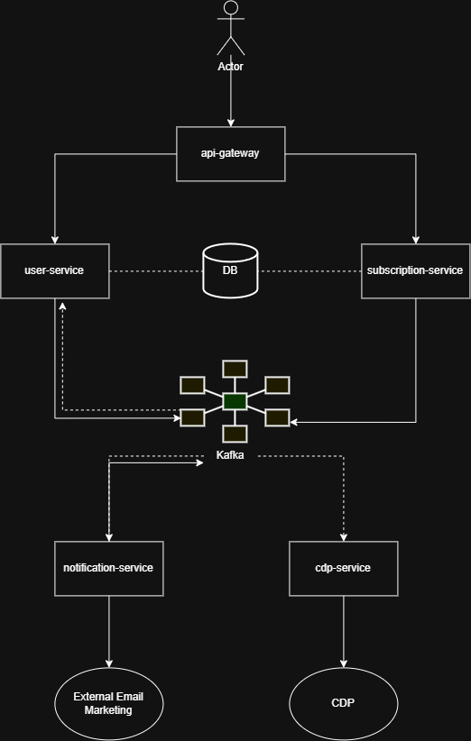

# Newsletter Subscription

## Project Overview
This project is a microservices-based application that allows users to manage their accounts and subscribe to newsletters. The system is designed to be scalable and resilient, with a focus on data consistency and fault tolerance.

## Architecture
This project follows a microservices architecture and is built using the following technologies:
- **Java 25**
- **Spring Boot 4.1.0**
- **Gradle**
- **Docker**
- **PostgreSQL** (as the primary database)
- **Kafka** (for asynchronous communication between services)
- **KeyCloak** (for authentication and authorization)
- **WireMock** (for local email testing)

The application is divided into the following microservices:
- **user-service**: Manages user accounts (registration, updates, deletion).
- **subscription-service**: Handles newsletter subscriptions and unsubscriptions, including the double opt-in process.
- **api-gateway**: Provides a single entry point for all API requests and routes them to the appropriate service.
- **cpd-service**: Forwards user data to a Customer Data Platform (CDP) via its API.
- **notification-service**: Forwards endpoint to the user's email.

## Design
The system is designed as an event-driven microservices architecture built for scalability, high availability, and fault tolerance against network issues, peak loads, and service outages.
### System architecture diagram

### Database diagram


### User and Subscription Management
- Account Lifecycle: The *user-service* manages CRUD operations for user profiles. Also, the authentication is done in this service through Keycloak.
- Instant Subscription Retrieval: subscription-service handles all subscription management.
- Some indexes were added to the tables to get the data faster.

### Double Opt-In Flow
- Subscription Request: A user submits a subscription request via api-gateway to subscription-service.
- Pending Token Generation: subscription-service creates an entry in User_subscription with a status of PENDING and logs an Opt_in verification record containing a unique verification token.
- Email Dispatch: An Outbox polling task publishes the event to Kafka. The notification-service consumes this message and triggers a confirmation email via the Email Provider (simulated using WireMock).
- After the user confirms the subscription through a link with its respective token, an event is committed to the local outbox_event table and send a notification through Kafka.
- Confirmation: The user clicks the link in the email. subscription-service verifies the token, marks the subscription as CONFIRMED, and triggers the creation of an outbox event and send the notification with Kafka.

### Fault-Tolerant CDP Synchronization (Transactional Outbox Pattern)
- CDP Forwarding: The dedicated cpd-service consumes events asynchronously from Kafka and pushes them to Segment ([https://api.segment.io/v1](https://api.segment.io/v1)).
- Finally updates the outbox event as processed.

### System Resilience
- **Network Issues**: The use of the Transactional Outbox pattern and Kafka ensures that data will be delivered to the CDP even if there are temporary network issues.
- **Service Outages**: If a service is down, Kafka will retain the messages until the service is back online.
- **Latency**: The asynchronous nature of the communication between services helps to handle latency and peak loads.

## Architectural Recommendations & Missing Components
To evolve this architecture into a fully production-grade solution, the following components and improvements should be introduced:

1. **Standalone Outbox Processor Service**
   * Current State: Outbox events are currently polled or published directly within the business domain services (subscription-service and cpd-service).

2. **Caching Layer**
   * Target Improvement: Implement an in-memory caching store directly behind api-gateway or inside subscription-service.

   * Endpoints to Cache:
     * GET /subscriptions (frequently read, rarely changed per user session).
     * GET /user/{userId}/subscriptions (static/semi-static master data).

   * Benefit: Protects the database from redundant read operations during severe traffic spikes and ensures sub-millisecond retrieval latency for current subscription data.

3. Full Observability Stack (Prometheus & Grafana)
   * Target Improvement: Integrate Micrometer in all Spring Boot microservices to export metrics, paired with Prometheus for scraping and Grafana for dashboarding.
   * Key Metrics to Monitor:
     * Monitor the services to catch processing delays early.
     * Kafka Consumer Lag: Monitor cpd-service and notification-service consumer group lag to catch processing delays early.
     * Outbox Processing Latency: Track time elapsed between DB outbox insertion and Kafka message publish.
     * HTTP Request Duration & Error Rates: Monitor 5xx thresholds on api-gateway during peak loads.

## Getting Started
1.  **Prerequisites**:
    *   [Git](https://git-scm.com/install/)
    *   [OpenJDK 25](https://adoptopenjdk.net/)
    *   [Gradle](https://gradle.org/install/)
    *   [Docker](https://docs.docker.com/engine/install/) and [Docker Compose](https://docs.docker.com/compose/install/)
2.  **Clone the repository**:
    ```
    git clone <repository-url>
    ```
3.  **Build the project**:
    ```
    ./gradlew clean build
    ```
4.  **Run the application**:
    ```
    docker-compose -f docker-compose-local.yaml up -d
    ```
5.  **Keycloak Pre-configuration**

    Before starting the entire application stack, Keycloak and its database must be running first so you can set up the required realm, client, and authentication secret needed by user-service.

    ***Step A: Start Keycloak & Keycloak DB***
    ```
    docker-compose -f docker-compose-local.yaml up -d keycloak keycloak-db
    ```
    (Wait 30-60 seconds for Keycloak to complete initialization)

    ***Step B: Configure Keycloak via UI***
    * Access the Keycloak Admin Console at http://localhost:8091.

    * Log in using the admin credentials (admin / admin).

    * Create Realm: Create a realm matching the name configured in user-service parameters (ns-security-realm).

    * Create Client: Navigate to Clients > Create Client. Set the Client ID to newsletter-subscription-client (as configured in user-service). Enable Client Authentication (Confidential access type) and Service Accounts Roles.

    * Assign Role: Go to the client's Service account roles tab. Assign the manage-clients role (under realm-management).

    * Obtain Client Secret: Go to the Credentials tab and copy the generated Client Secret.
      
    ***Step C: Update Configuration***
    * Open docker-compose-local.yaml and paste the client secret into the user-service environment parameters:
      ```
      user-service:
        environment:
          - KEYCLOAK_CLIENT_SECRET=<your-copied-client-secret>
      ```
    * Run the application
      ```
      docker-compose -f docker-compose-local.yaml up -d
      ```      

## API Documentation
The application provides an interactive API documentation through Swagger UI. Once the application is running, you can access it at:
- **Swagger UI**: `http://localhost:9000/swagger-ui/index.html` (via the API Gateway)
